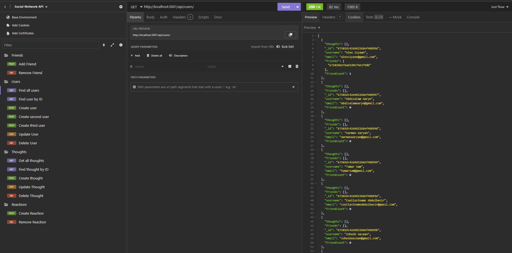

# Social-Network-API

## Description

This is a social network web application where users can share their thoughts, react to friends' thoughts, and create a friend list. It uses Express.js for routing, a MongoDB database, and the Mongoose ODM. In addition to using the Express.jsLinks to an external site. and MongooseLinks to an external site. packages, it also uses a JavaScript date library to format timestamps.

AS A social media startup
I WANT an API for my social network that uses a NoSQL database
SO THAT my website can handle large amounts of unstructured data

## Usage

To use this application: 
1. Run "npm run i"
2. Run "npm run build"
3. Run "npm run seed"
4. Run "npm run start"

This'll run the program on localhost://3001
Open an insomnia environment, and you'll be able to run the api routes to manipulate the database

## License

This application is covered under the [MIT](./LICENSE) license

## Features

GIVEN a social network API
- WHEN I enter the command to invoke the application
- THEN my server is started and the Mongoose models are synced to the MongoDB database

- WHEN I open API GET routes in Insomnia for users and thoughts
- THEN the data for each of these routes is displayed in a formatted JSON

- WHEN I test API POST, PUT, and DELETE routes in Insomnia
- THEN I am able to successfully create, update, and delete users and thoughts in my database

- WHEN I test API POST and DELETE routes in Insomnia
- THEN I am able to successfully create and delete reactions to thoughts and add and remove friends to a user's friend list